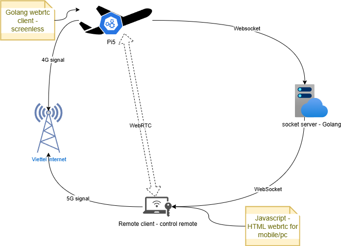
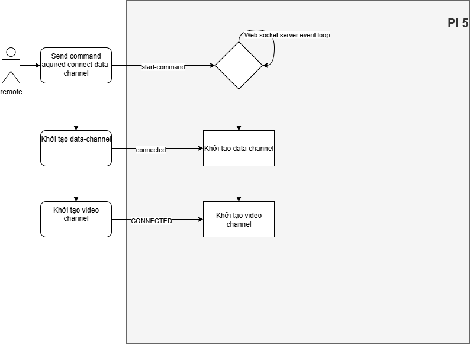

# Client Webrtc in Golang

## 1. Test websocket

wscat is a popular command-line WebSocket client. You can use it to test your WebSocket server.

### Steps:
Install wscat (requires Node.js and npm):
> cd ../ui
> 
> npm install -g wscat

Start the Go WebSocket server.
#### Connect to the WebSocket server using wscat:

> wscat -c ws://localhost:8080/ws

#### Send a message to the server:

> Hello, Server!

The server will echo the message back, and you’ll see it in the terminal.

#### Join room chat:
```bash
wscat -c ws://localhost:8080/ws/join/1234/c/alice
Connected (press CTRL+C to quit)
wscat -c ws://localhost:8080/ws/join/1234/c/bob
Connected (press CTRL+C to quit)
```
- log on server:
```log
[GIN-debug] Listening and serving HTTP on :8080
2025/02/21 15:56:45 main.go:31: server run in: 8080
2025/02/21 15:58:27 ip_logger.go:12: IP Address: 127.0.0.1
2025/02/21 15:58:27 webrtc.go:57: [1234] alice joined room 1234
2025/02/21 16:05:15 ip_logger.go:12: IP Address: 127.0.0.1
2025/02/21 16:05:15 webrtc.go:57: [1234] bob joined room 1234
```
- send a message:
 ```bash
// Alice typing:
> {"from":"alice","to":"bob","msg":"Hello Bob","roomId":"1234"}
> {"from":"bob","to":"alice","msg":"Nice 2 meet u","roomId":"1234"}
```
- log in server:
```log
2025/02/21 16:36:37 ip_logger.go:12: IP Address: 127.0.0.1
2025/02/21 16:36:37 webrtc.go:62: [1234] alice joined room 1234
2025/02/21 16:36:40 ip_logger.go:12: IP Address: 127.0.0.1
2025/02/21 16:36:40 webrtc.go:62: [1234] bob joined room 1234
2025/02/21 16:36:48 webrtc.go:93: Received: {alice bob Hello Bob 1234}
```
- log in Bob wscat client:
```log
Connected (press CTRL+C to quit)
< {"from":"alice","to":"bob","msg":"Hello Bob","roomId":"1234"}
```

## 2. WebRTC Golang client for UAV
### 1. Init project
```bash
cd go-webrtc-signal-server/ui/go-client
go mod init github.com/uav-project-com/go-webrtc-signal-server/go-rtc-client
# update project lib
go mod tidy
```
## 3. Infrastructure
<style>img {background-color: white;}</style>


- Pi5 project client location: `go-webrtc-signal-server/ui/go-client`
- Remote client web UI: `go-webrtc-signal-server/ui/src`
- Socket server (golang): `go-webrtc-signal-server/controllers)`

```cmd
## KILL golang process in Windows
PS C:\WINDOWS\system32> tasklist | findstr go
winlogon.exe                  1700 Console                    1      8,496 K
___138go_build_go_rest_ap    29664 Console                    1     18,040 K
goland64.exe                 31932 Console                    1  2,269,036 K
goland64.exe                  3512 Console                    1     51,504 K
goland64.exe                 18116 Console                    1     22,184 K
gopls.exe                     5844 Console                    1    573,040 K
gopls.exe                    32228 Console                    1     18,308 K
PS C:\WINDOWS\system32> taskkill /PID 29664 /F
```

## 4. Golang client communication
<style>img {background-color: white;}</style>
X:\workspace\0.FPV\go-webrtc-signal-server\docs\golang-client.png

# Room hard code DB: 24G-ZT0-Q8T

# UAV command list
| Command                    | msg-key                              | Description                  |
|----------------------------|:-------------------------------------|------------------------------|
| request_join_data_channel  | 839d6af5-be15-474d-81c8-f34200007d4c | Connect data channel Webrtc. |
| request_join_video_channel | 493aaf25-eea6-4f37-8f9f-eb4507811721 | Request video FPV.           |
|                            |                                      |                              |
|                            |                                      |                              |

## Cancel video example

`cancel` is the `context.CancelFunc` returned by `context.WithCancel`. Calling it signals the context's `Done()` channel, which causes the two goroutines in `setupTrackHandlers` (PLI ticker and RTP reader) to exit cleanly. The function is also called automatically inside `setupTrackHandlers` when the PeerConnection state becomes closed/failed/disconnected.

Brief example showing how to store and call `cancel` when removing/closing a peer:

Explanation: adds a `trackCancels` map to store cancels per-peer, appends the cancel returned by `setupTrackHandlers`, and calls them on `Close` to stop goroutines immediately.

```go
package webrtc

// Add field to VideoChannelClient:
// trackCancels map[string][]context.CancelFunc

// When handling OnTrack:
cancel := setupTrackHandlers(pc, track)
c.mu.Lock()
c.trackCancels[sid] = append(c.trackCancels[sid], cancel)
c.mu.Unlock()

// In Close (or when removing a peer):
c.mu.Lock()
for _, cancels := range c.trackCancels {
    for _, fn := range cancels {
        fn() // stop goroutines for that track
    }
}
c.mu.Unlock()
for _, pc := range c.peers {
    _ = pc.Close()
}
```
