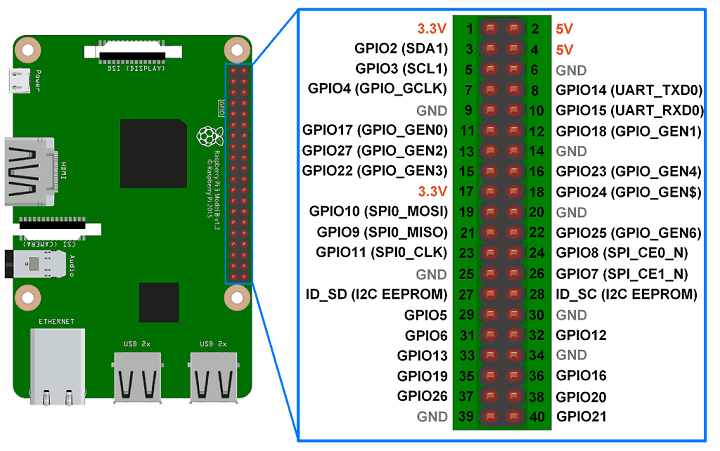
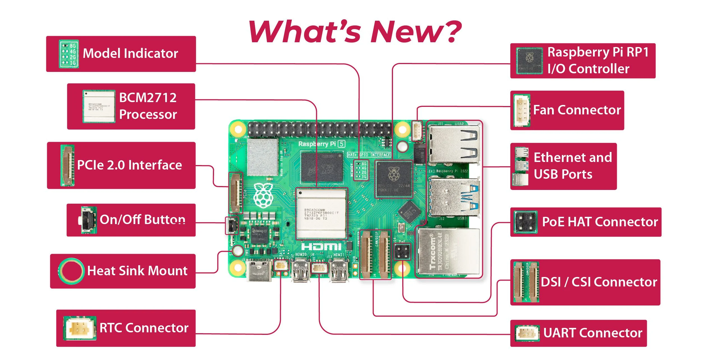

# Hướng dẫn sử dụng Raspberry Pi


## Boot Raspberry Pi
```bash
ssh  assmin@192.168.1.15
# pw: singobell
# HDMI: ko thấy lên hình: do màn hình tắt trước khi nó boot lên => nhổ hdmi ra cắm lại là nó nhận
```

## Thông tin camera
```bash
assmin@raspberrypi:~ $ rpicam-hello --list-cameras
0 : imx219 [3280x2464 10-bit] (/base/axi/pcie@120000/rp1/i2c@88000/imx219@10)
    Modes: 'SBGGR10_CSI2P' : 640x480 [30.00 fps - (65535, 65535)/65535x65535 crop]
                             1640x1232 [30.00 fps - (65535, 65535)/65535x65535 crop]
                             1920x1080 [30.00 fps - (65535, 65535)/65535x65535 crop]
                             3280x2464 [30.00 fps - (65535, 65535)/65535x65535 crop]
           'SBGGR8' : 640x480 [30.00 fps - (65535, 65535)/65535x65535 crop]
                      1640x1232 [30.00 fps - (65535, 65535)/65535x65535 crop]
                      1920x1080 [30.00 fps - (65535, 65535)/65535x65535 crop]
                      3280x2464 [30.00 fps - (65535, 65535)/65535x65535 crop]
```

## Install lib on Pi5 for golang
```bash
sudo apt update
sudo apt install golang gcc sqlite3 libsqlite3-dev
sudo apt install build-essential
sudo apt install -y gstreamer1.0-tools \
  gstreamer1.0-plugins-base gstreamer1.0-plugins-good \
  gstreamer1.0-plugins-bad gstreamer1.0-plugins-ugly \
  gstreamer1.0-libcamera libcamera-apps
```
## Camera Implementation (camera_manager.go)
File `go-client/webrtc/camera_manager.go` tự động phát hiện môi trường chạy:
1.  **Laptop (Ubuntu/Arch/Fedora):** Sử dụng `ffmpeg` qua `v4l2src` (giả lập).
2.  **Raspberry Pi (Debian/Raspbian):** Sử dụng `PiCameraManager` với GStreamer (`gst-launch-1.0`).

### Pipeline trên Pi 5
Do Pi 5 không có bộ mã hóa H.264 phần cứng (hardware encoder), chúng ta sử dụng **CPU encoding** (`x264enc`) nhưng được tối ưu cho độ trễ cực thấp (Ultra Low Latency).

Pipeline hoạt động như sau:
`libcamerasrc` -> `videoconvert` -> `x264enc` -> `rtph264pay` -> `udpsink`

Các tham số quan trọng:
*   `libcamerasrc`: Nguồn dữ liệu từ module camera (qua libcamera).
*   `video/x-raw,format=NV12`: **BẮT BUỘC** phải dùng định dạng màu `NV12` để tương thích với bộ xử lý ảnh PiSP của Pi 5 (nếu không sẽ lỗi `not-negotiated`).
*   `x264enc`: Bộ mã hóa mềm H.264.
    *   `speed-preset=ultrafast`: Ưu tiên tốc độ xử lý hơn chất lượng nén.
    *   `tune=zerolatency`: Giảm độ trễ xuống mức tối thiểu (không buffer frame).
    *   `bframes=0`: **BẮT BUỘC** để tắt B-Frames. WebRTC và trình duyệt thường không giải mã được video có B-Frames theo thời gian thực (gây hiện tượng màn hình đen).
*   `rtph264pay`: Đóng gói luồng video H.264 thành các gói tin RTP.
*   `udpsink`: Gửi gói tin RTP đến `localhost:5600`.

### Luồng dữ liệu (Data Flow)
1.  `PiCameraManager` khởi chạy tiến trình `gst-launch-1.0`.
2.  GStreamer gửi gói tin RTP về cổng UDP 5600.
3.  `video_channel.go` mở cổng UDP 5600 để lắng nghe.
4.  Do `IsRTP()` trả về `true`, `video_channel.go` nhận biết đây là luồng RTP và chuyển tiếp thẳng (`Keep-As-Is`) vào WebRTC Track (`TrackLocalStaticRTP`) mà không cần phân tích NAL Unit thủ công.
5.  WebRTC Agent gửi dữ liệu này qua mạng tới Browser.

### Debug turning video

```bash
# Pi5:
rpicam-vid -t 0 --inline --framerate 60 --codec h264 --tuning-file /usr/share/libcamera/ipa/rpi/pisp/pi5_imx219_160d.json -l -o tcp://0.0.0.0:5600

# laptop:
ffplay tcp://192.168.1.24:5600 -framerate 60 -analyzeduration 1 -fflags nobuffer

```
