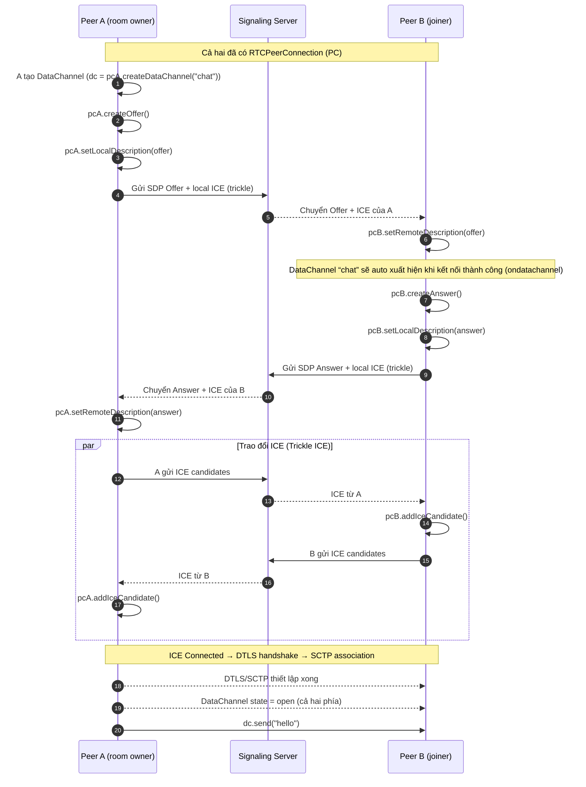
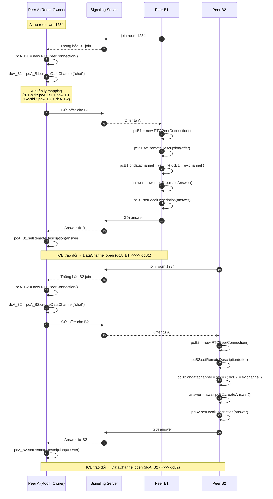
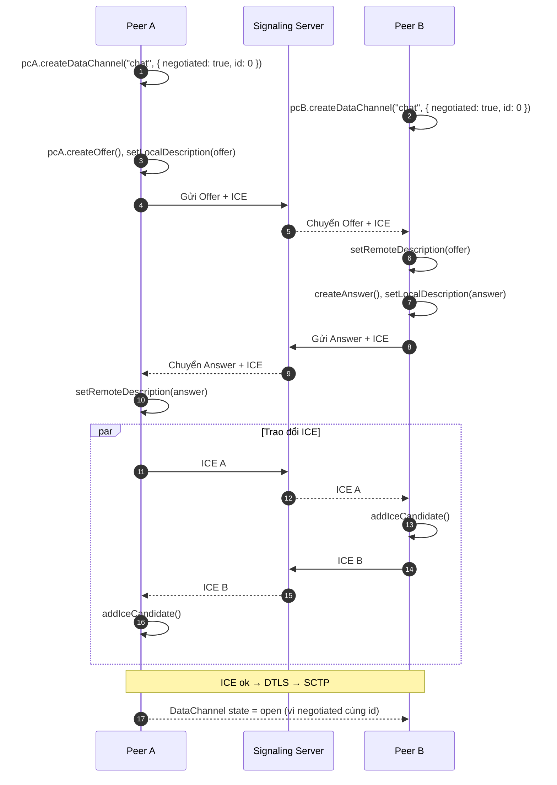
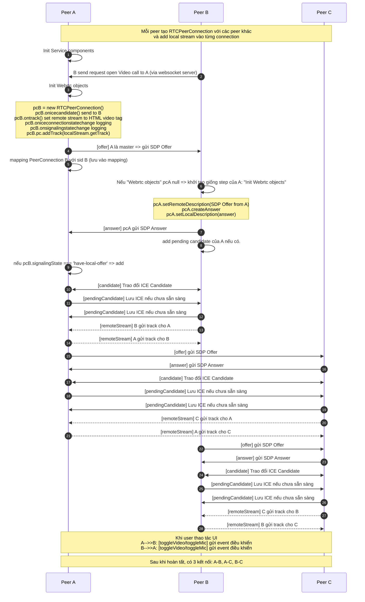

# WEBRTC Library common for nodejs

## 1. Build
> npm run build

- tại project cha dùng thư viện
  - Local: `"webrtc-common": "file:webrtc-common",`
  - Online: public lên registry server như npm package rồi import như thuường

## 2. Tài liệu tổng quan
- TODO

## 3. Data channel
- cho phép gửi nhận message qua rtc giữa các peers
- Sơ đồ:
  Dưới đây là **sequence diagram** thể hiện quy trình “bắt tay” (signaling + ICE + DTLS/SCTP) mở **WebRTC DataChannel** giữa A và B, với **A là người tạo room**.

### 1) Trường hợp phổ biến: A tạo DataChannel trước (in-band, `negotiated: false`)



Rồi 👍. Mình sẽ vẽ sơ đồ với **nhiều client (B1, B2, B3)** join vào room do **A làm host**.
Mỗi khi có client join, **A tạo PeerConnection riêng + DataChannel riêng**, rồi mapping chúng theo `sid` (session id).

---

### 🌐 Luồng tổng quát

1. **A tạo room ws 1234**.
2. **B1, B2, B3** lần lượt join → signaling server báo cho A.
3. Với mỗi client mới:

   * A tạo `pcA_Bx = new RTCPeerConnection()`
   * A tạo `dcA_Bx = pcA_Bx.createDataChannel("chat")`
   * A gửi Offer cho client.
   * Client setRemote → Answer → gửi lại.
   * A setRemote Answer.
   * ICE trao đổi → DataChannel open.
4. A quản lý một **bảng mapping**:

   ```js
   {
     "B1-sid": { pc: pcA_B1, dc: dcA_B1 },
     "B2-sid": { pc: pcA_B2, dc: dcA_B2 },
     "B3-sid": { pc: pcA_B3, dc: dcA_B3 }
   }
   ```

---

### 📌 Sơ đồ



---

### ✅ Ưu điểm mô hình này

* **Quản lý dễ dàng**: A biết chính xác mỗi client tương ứng PeerConnection nào.
* **Có thể broadcast hoặc gửi riêng**:

  * Gửi riêng: `mapping[sid].dc.send(msg)`
  * Gửi broadcast: lặp qua tất cả `mapping`.
* **Scalable**: Có thể mở rộng cho N clients.

### ✅ Giải thích thêm

* Ở phía **A**: gọi `pc.createDataChannel("chat")` trước khi gửi Offer.
* Ở phía **B**: không tạo channel, mà chờ event:

  ```js
  pc.ondatachannel = (ev) => {
      const dc = ev.channel;
      dc.onmessage = (msg) => console.log("Got:", msg.data);
  };
  ```
* Nhờ vậy mà **B chỉ passively nhận** DataChannel, không cần đồng bộ `id` thủ công.

---

### 2) Trường hợp “đàm phán sẵn” (`negotiated: true`)

> Cả A và B đều **tạo DataChannel bằng cùng `id`** và **không** đi kèm trong SDP. Phần còn lại (Offer/Answer, ICE, DTLS/SCTP) giống hệt.



### Ghi chú nhanh

* **Signaling server** chỉ chuyển tiếp Offer/Answer và ICE (WebSocket/HTTP tuỳ bạn), không phải WebRTC.
* **Thứ tự “mở” DataChannel**:

  * In-band: A gọi `createDataChannel()` trước khi Offer → B nhận qua `ondatachannel`.
  * Negotiated: Cả hai tự tạo với cùng `id`, không có `ondatachannel`.
* DataChannel chỉ **thực sự “open”** sau khi: ICE connected → **DTLS handshake** xong → **SCTP association** lên.

`negotiated: true` là một **tuỳ chọn khi tạo DataChannel trong WebRTC**, và nó quyết định cách DataChannel được thiết lập giữa hai peer:

---

### 🔹 Mặc định (`negotiated: false`)

* Đây là chế độ phổ biến.
* Khi **A** gọi:

  ```js
  const dc = pcA.createDataChannel("chat");
  ```

  → Thông tin về DataChannel này sẽ được **đính kèm vào SDP Offer**.
* **B** sau khi nhận Offer/Answer sẽ **không cần gọi createDataChannel()**.
* Thay vào đó, B sẽ nhận kênh này qua sự kiện:

  ```js
  pcB.ondatachannel = (event) => {
      const dc = event.channel;
  };
  ```
* Nói cách khác: **chỉ một phía gọi createDataChannel**, phía kia được “tự động báo” (in-band negotiation).

---

### 🔹 `negotiated: true`

* Nghĩa là **DataChannel này không được báo trong SDP**.
* Hai phía phải **tự thoả thuận trước** về:

  * `label` (tên kênh, ví dụ `"chat"`) → để dễ hiểu
  * `id` (số kênh SCTP, ví dụ `0`) → bắt buộc phải giống nhau
* Cả hai phía đều phải gọi cùng đoạn code:

  ```js
  const dc = pc.createDataChannel("chat", {
      negotiated: true,
      id: 0
  });
  ```
* Không có sự kiện `ondatachannel`, vì cả hai đã “biết sẵn” sẽ tạo kênh này.
* Ưu điểm:

  * Giảm bớt signaling (không cần đưa DataChannel vào SDP).
  * Cho phép bạn kiểm soát chính xác `id` (quan trọng nếu muốn nhiều kênh song song).
* Nhược điểm:

  * Bạn phải tự đồng bộ `id` giữa hai peer → dễ sai nếu không cẩn thận.

---

👉 Tóm gọn:

* **`negotiated: false`** = tiện lợi, một bên tạo, bên kia nhận qua `ondatachannel`.
* **`negotiated: true`** = cả hai bên phải tự tạo trước, với cùng `id`, không có “auto thông báo”.

---

# Video call

## Sơ đồ full mesh A-B-C 6 pc


